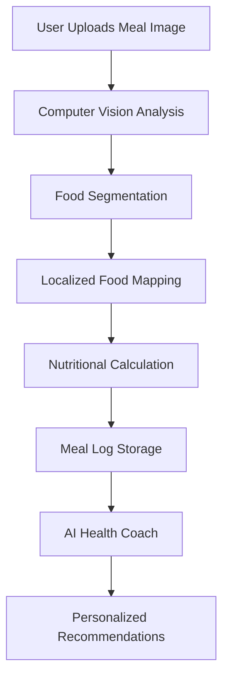

# Nymit - Nutrition and Fitness Ecosystem

Nymit is a full-stack health application designed to simplify calorie tracking and fitness coaching. By combining multimodal computer vision models with a highly localized database, Nymit automatically segments and analyzes complex meals, estimates macronutrient and micronutrient values, and provides real-time, context-aware health coaching tailored to specific regional dietary profiles.

---

## Core Features

### Multimodal Food Analysis

Utilizes computer vision pipelines to perform semantic segmentation on meal photographs, automatically identifying multiple individual components within a single dish or plate configuration.

### Localized Nutritional Database

Maps detected food items to a regional database that accounts for culinary variations, hidden preparation fats, and local ingredient metrics.

### Proactive AI Health Coach

Interprets user biometric data and daily tracking logs to deliver contextually relevant dietary insights and macro-optimization suggestions.

### Adaptive Target Calculation

Computes dynamic Total Daily Energy Expenditure (TDEE) and Basal Metabolic Rate (BMR) targets based on user physical metrics and health goals.

### Biometric Data Aggregation

Syncs with native device health APIs to incorporate daily step counts, hydration metrics, and sleep quality into the coaching logic.

---

## Technical Architecture

The application is built using a modern full-stack TypeScript ecosystem optimized for performance, security, and responsive layouts.

### Frontend & UI Layer

- **Framework:** Next.js (App Router) for unified server-side rendering and client-side routing.
- **Styling:** Tailwind CSS integrated with ShadCN UI components for a robust design system.
- **Icons & Motion:** Lucide React and Framer Motion for interface feedback and state transitions.

### Backend & Infrastructure

- **Runtime:** Bun for fast dependency management, bundling, and script execution.
- **Database & Storage:** Supabase (PostgreSQL) for transactional data persistence, user profiles, relational food logs, and secure storage.
- **Intelligence Engine:** Integration with Gemini models for image analysis and structured JSON schema extraction.

---

## Directory Structure

```text
nymit/
├── app/                        # Next.js App Router core routing
│   ├── api/                    # Serverless API endpoints (Vision, Analytics)
│   ├── authentication/         # User auth pages and access control hooks
│   ├── globals.css             # Global Tailwind stylesheets
│   ├── layout.tsx              # Root layout wrapper
│   └── page.tsx                # Central application landing dashboard
│
├── components/                 # Reusable UI component architecture
│   ├── theme-provider.tsx      # Next-themes context wrapper
│   └── ui/                     # Design system primitives (grids, inputs, cards)
│
├── lib/                        # Shared utilities, client initializers, and helpers
│   └── utils.ts                # Tailwind merge and utility functions
│
├── postcss.config.mjs          # PostCSS processing configurations
├── tailwind.config.ts          # Tailwind tokens and theme extensions
└── tsconfig.json               # TypeScript compiler settings
```

---

## Getting Started

### Prerequisites

Ensure the following software and services are available:

- Bun Runtime
- PostgreSQL or an active Supabase project
- Gemini API access credentials

---

## Installation

### 1. Clone the Repository

```bash
git clone <repository-url>
cd nymit
```

### 2. Install Dependencies

```bash
bun install
```

### 3. Configure Environment Variables

Copy the example environment file:

```bash
cp .env.example .env
```

Update the `.env` file with your credentials:

```env
NEXT_PUBLIC_SUPABASE_URL=your_supabase_project_url
NEXT_PUBLIC_SUPABASE_ANON_KEY=your_supabase_anonymous_key
SUPABASE_SERVICE_ROLE_KEY=your_supabase_service_role_secret
GEMINI_API_KEY=your_google_gemini_api_key
```

---

## Running the Development Server

Start the local development environment:

```bash
bun dev
```

The application will be available at:

```text
http://localhost:3000
```

---

## Production Deployment

### Build Configuration

Generate optimized production builds:

```bash
bun run build
```

Verify that the build completes successfully without compilation errors, warnings, or linting issues.

### Environment Variables

When deploying to platforms such as:

- Vercel
- AWS
- Docker / Containerized Environments
- Self-hosted Infrastructure

Ensure all environment variables from your local `.env` file are configured within the deployment platform's secure settings.

---

## Database Migration

The relational database layer relies on:

- Foreign key constraints
- Structured enum states
- Indexed user identifiers
- Timestamp-based query optimization

To initialize the database:

1. Open the Supabase SQL Editor.
2. Execute the schema setup scripts for:
   - User profiles
   - Meal logs
   - Sequential tracking entries

3. Create indexes on:
   - User validation IDs
   - Chronological timestamp fields

Proper indexing ensures efficient query performance as user activity scales.

---

## AI Workflow Overview



---

## Technology Stack

| Category       | Technology          |
| -------------- | ------------------- |
| Frontend       | Next.js             |
| Language       | TypeScript          |
| Styling        | Tailwind CSS        |
| UI Components  | ShadCN UI           |
| Runtime        | Bun                 |
| Database       | Supabase PostgreSQL |
| Authentication | Supabase Auth       |
| AI Vision      | Gemini Models       |
| Animation      | Framer Motion       |
| Icons          | Lucide React        |

---

## License

This software project is distributed under the terms of the open-source license included in the repository.

For detailed permissions, warranties, and compliance requirements, refer to the `LICENSE` file located in the project root.
